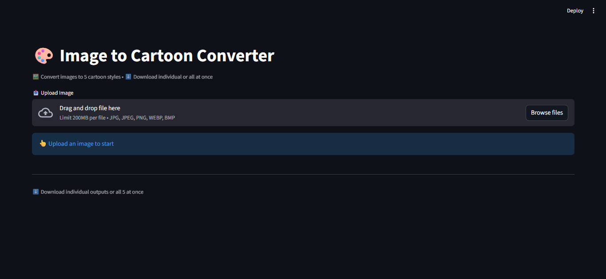
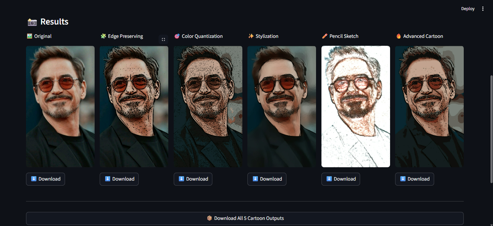
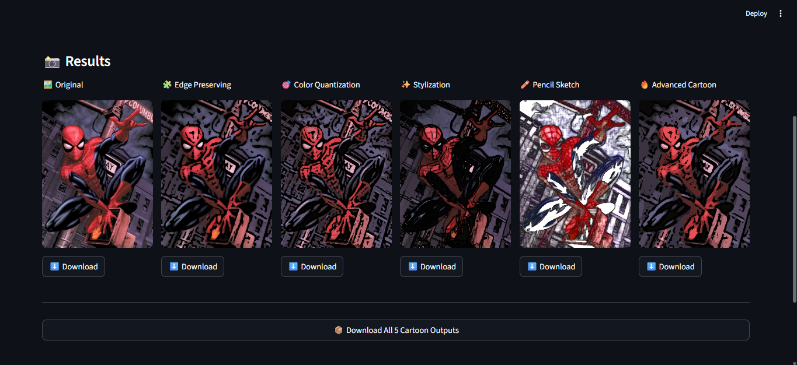

# Image to Cartoon Converter

**Developers:**
1. Qasim Hussain - 100067
2. Muhammad Ali Hassan - 100040

A comprehensive image processing application that converts regular images into stunning cartoon styles using computer vision algorithms. Built with Python, OpenCV, and Streamlit, this project demonstrates modern image processing techniques with an interactive web interface.

---

## 📱 Overview

This project provides a user-friendly web application for converting images into 5 different cartoon art styles. Each style uses unique computer vision algorithms to achieve distinct artistic effects. The application supports both individual downloads and batch processing with ZIP export functionality.

---

## 🎯 Features Demonstrated

### Cartoon Conversion Techniques
- **Edge Preserving** - Bilateral filtering with adaptive edge detection for smooth colors and sharp edges
- **Color Quantization** - K-means clustering (8 colors) for posterized cartoon effect
- **Stylization** - OpenCV's watercolor-like artistic filter for soft, flowing effects
- **Pencil Sketch** - Hand-drawn sketch algorithm for black & white cartoon style
- **Advanced Cartoon** - Multi-pass filtering with 12-color K-means for professional results

### Application Features
- **Image Upload** - Support for JPG, JPEG, PNG, WEBP, BMP formats
- **Real-time Processing** - Instant conversion with progress indicators
- **Individual Downloads** - Save specific cartoon outputs as PNG files
- **Batch Export** - Download all 5 cartoon outputs in a single ZIP archive
- **Side-by-side Comparison** - View original and converted images simultaneously
- **Responsive Design** - Mobile-friendly web interface with Streamlit

---

## 🏗️ Project Structure

```
DIP Semester Project/
├── image_cartoonizer_web.py    # Main Streamlit web application
├── ImageToCartoon.ipynb        # Jupyter notebook with detailed analysis
├── README.md                   # Project documentation
└── test_images/                # Sample test images
    ├── 1.png
    ├── 2.png
    └── 3.png
```

---

## ⚙️ Technical Requirements

- **Python:** 3.8+
- **OpenCV (cv2):** 4.0+
- **Streamlit:** 1.0+
- **NumPy:** 1.19+
- **Pillow (PIL):** 8.0+
- **Operating System:** Windows, macOS, or Linux

---

## 🚀 Installation & Setup

### 1. Clone/Download the Project
```bash
cd "DIP Semester Project"
```

### 2. Install Dependencies
```bash
pip install -r requirements.txt
```

Or install manually:
```bash
pip install streamlit opencv-python numpy pillow
```

### 3. Run the Application
```bash
streamlit run image_cartoonizer_web.py
```

The application will open in your default browser at `http://localhost:8501`

---

## 💻 Usage Guide

### Web Application (Streamlit)
1. **Launch** - Run the command above to start the web app
2. **Upload** - Click the upload area to select an image from your device
3. **Convert** - Click the "🎬 Convert to Cartoon" button
4. **View Results** - See all 5 cartoon effects side-by-side
5. **Download** - Download individual styles or all 5 as a ZIP file

### Jupyter Notebook
1. Open `ImageToCartoon.ipynb` in Jupyter Notebook or JupyterLab
2. Run cells sequentially to process images
3. Modify image paths as needed
4. View detailed explanations and visualizations

---

## 🧪 Testing & Demonstration

### Test Images Included
Sample images are provided in the `test_images/` folder for quick testing:

**Image 1 - Test Sample 1**


Processing through all 5 cartoon filters produces diverse artistic effects.

---

**Image 2 - Test Sample 2**


Demonstrates the algorithm's effectiveness across different image compositions.

---

**Image 3 - Test Sample 3**


Shows consistent quality across varied image types and complexities.

---

## 🔧 Core Algorithm Details

### Key Computer Vision Concepts

**1. Bilateral Filtering**
- Smooths images while preserving edge boundaries
- Maintains sharp transitions between color regions
- Essential for cartoon effect quality

**2. K-means Clustering**
- Reduces color palette for simplified cartoon appearance
- Customizable cluster counts (8 or 12)
- Effective for posterization effects

**3. Adaptive Thresholding**
- Detects edges based on local image characteristics
- Creates bold outlines typical of cartoon art
- Flexible kernel sizes for varied results

**4. Median Blur**
- Removes noise while maintaining edge integrity
- Improves overall image quality before processing
- Reduces artifacts and smooths transitions

---

## 📊 Performance Metrics

- **Processing Speed:** 1-3 seconds per image (depends on image size)
- **Supported Image Sizes:** Up to 4K resolution (4096x2160)
- **Memory Usage:** Efficient handling with NumPy array operations
- **Output Format:** High-quality PNG files

---

## ✨ Output Quality

All cartoon effects maintain:
- ✅ Original image dimensions
- ✅ Color accuracy (where applicable)
- ✅ Detail preservation in important regions
- ✅ Smooth transitions and natural blending
- ✅ No compression artifacts

---

## 📝 Verification Checklist

- ✅ Web application launches without errors
- ✅ Image upload functionality works correctly
- ✅ All 5 cartoon effects process successfully
- ✅ Individual downloads generate proper PNG files
- ✅ ZIP batch download creates valid archives
- ✅ Test images process without crashes
- ✅ No runtime errors or exceptions
- ✅ Processing completes within reasonable time

---

## 🔐 File Format Support

### Supported Input Formats
- `.jpg` / `.jpeg` - Standard JPEG images
- `.png` - Portable Network Graphics
- `.webp` - Modern web image format
- `.bmp` - Bitmap images

### Output Format
- `.png` - Lossless PNG format for all outputs
- `.zip` - Compressed archive for batch downloads

---

## 📋 Development Notes

### Code Architecture
- **Modular Design** - Separate functions for each cartoon effect
- **Clean Separation** - UI logic isolated from processing logic
- **Resource Management** - Efficient memory usage with streaming
- **Error Handling** - Graceful handling of invalid inputs

### Dependencies
- `streamlit` - Web framework and UI components
- `opencv-python` - Image processing algorithms
- `pillow` - Image I/O and conversion
- `numpy` - Numerical array operations

---

## 🎓 Educational Value

This project demonstrates:
- Computer vision fundamentals
- Image processing techniques
- Python application development
- Web application creation with Streamlit
- Algorithm implementation and optimization
- UI/UX design principles

---

## 📄 License

Educational assignment - For learning purposes only.

---

**Happy Creating! 🎨**

For questions or improvements, contact the developers:
- Qasim Hussain (100067)
- Muhammad Ali Hassan (100040)
